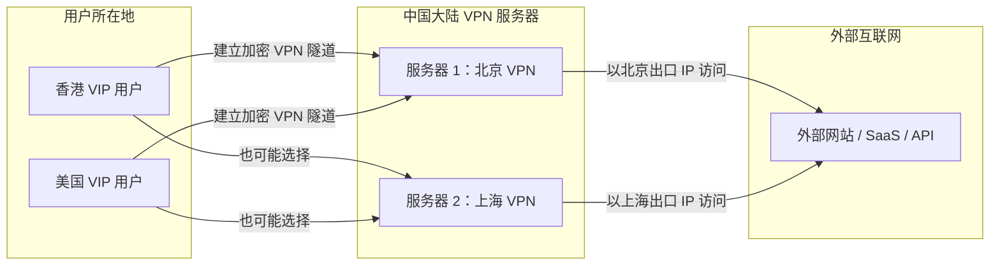
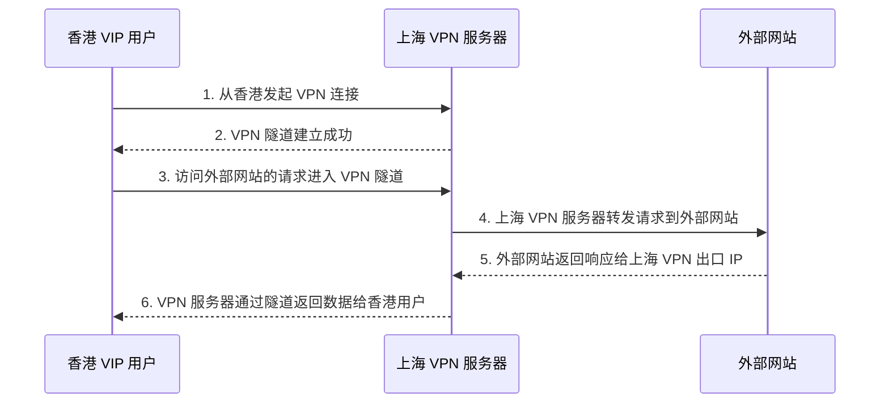
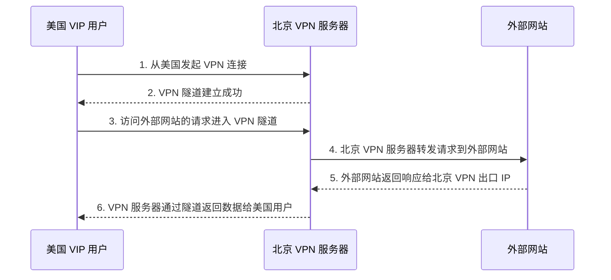
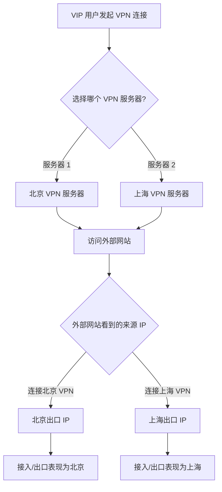

# VPN 链接示意图

## 需求说明

本示意图用于解释：**VIP 用户从香港接入时，VPN 接入点是否在香港**，以及当 VPN 服务器部署在中国大陆（例如北京、上海）时，用户访问外部网站的流量路径如何变化。

核心结论：

- 如果 VPN 服务器实际部署在中国大陆，例如北京或上海，那么用户即使身处香港，**VPN 的真正出口/接入服务器也不是香港，而是所连接的北京或上海服务器**。
- 用户访问外部网站时，流量通常会先从用户所在地进入 VPN 隧道，再到达中国大陆的 VPN 服务器，最后由该 VPN 服务器作为出口访问目标网站。
- 目标网站看到的访问来源 IP，通常是 **VPN 服务器的出口 IP**，而不是用户真实所在地 IP。

---

## 总体流向图

---

## 场景一：香港用户连接北京 VPN 服务器

### 说明

- 用户物理位置：香港
- VPN 服务器位置：北京
- 外部网站看到的来源：北京 VPN 服务器出口 IP
- 因此，**接入点/出口点表现为北京，而不是香港**。

---

## 场景二：香港用户连接上海 VPN 服务器

### 说明

- 用户物理位置：香港
- VPN 服务器位置：上海
- 外部网站看到的来源：上海 VPN 服务器出口 IP
- 因此，**如果连接的是上海服务器，访问出口就是上海**。

---

## 场景三：美国用户连接北京 VPN 服务器

### 说明

- 用户物理位置：美国
- VPN 服务器位置：北京
- 外部网站看到的来源：北京 VPN 服务器出口 IP
- 访问路径更长：美国用户 → 北京 VPN → 外部网站 → 北京 VPN → 美国用户。

---

## 场景四：美国用户连接上海 VPN 服务器

### 说明

- 用户物理位置：美国
- VPN 服务器位置：上海
- 外部网站看到的来源：上海 VPN 服务器出口 IP
- 访问路径为：美国用户 → 上海 VPN → 外部网站 → 上海 VPN → 美国用户。

---

## 关键判断逻辑

---

## 简化结论

| 用户所在地 | 连接的 VPN 服务器 | 外部网站看到的来源 | 是否表示香港接入 |
|---|---|---|---|
| 香港 | 北京 VPN | 北京出口 IP | 否 |
| 香港 | 上海 VPN | 上海出口 IP | 否 |
| 美国 | 北京 VPN | 北京出口 IP | 否 |
| 美国 | 上海 VPN | 上海出口 IP | 否 |

如果要让香港 VIP 用户的 VPN 接入点表现为香港，需要在香港部署 VPN 接入服务器或香港出口节点。否则，只要 VPN 服务器在北京或上海，最终访问外部网站时通常都会表现为北京或上海出口。

---

## 推荐表述

> VIP 用户从香港接入 VPN 时，用户发起连接的位置是在香港，但 VPN 服务端接入点取决于实际连接的服务器位置。如果 VPN 服务器部署在中国大陆，例如北京或上海，则流量会先通过加密隧道进入对应的大陆 VPN 服务器，再由该服务器访问外部网站。因此外部网站看到的来源通常是北京或上海 VPN 出口 IP，而不是香港 IP。
